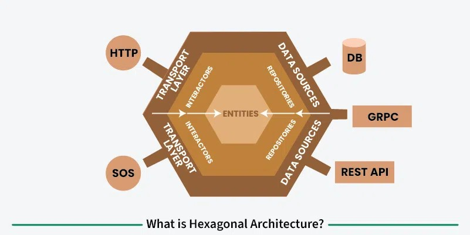

# OOSE Lesweek 08

## Design Patterns
Een ontwerppatroon biedt een schema voor het verfijnen van de subsystemen of componenten van een softwaresysteem, of de relaties tussen hen. 
Het beschrijft een vaak terugkerende structuur van communicerende componenten die een algemeen ontwerpprobleem oplost binnen een bepaalde context.

## Architectural Patterns
Een architecturaal patroon drukt een fundamenteel structureel organisatieschema uit voor softwaresystemen. 
Het biedt een set vooraf gedefinieerde subsystemen, hun verantwoordelijkheden en omvat regels en richtlijnen voor het organiseren van de relaties tussen hen.

## Opzet Voorbeelden

### Folder 0_Start
Deze simpele applicate bewaard de voorkeuren van een gebruiker in een profiel.
Dit is het basis project zonder gerbuik van patronen. 

### Folder 1_Facade voorbeeld
Het facade patroon is een ontwerppatroon dat wordt gebruikt om een eenvoudigere interface te bieden aan een complexer subsysteem. 
Het biedt een uniforme interface voor een set interfaces in een subsysteem. Dit patroon vermindert de complexiteit van de code door de complexiteit van het subsysteem te verbergen en een eenvoudigere interface te bieden aan de gebruiker.

Het facade patroon kan bijdragen aan het Single Responsibility Pattern, omdat het de verantwoordelijkheid van het subsysteem scheidt van de verantwoordelijkheid van de gebruiker.

- zonder facade
- met facade

### Folder 2_Layer (Lagen) voorbeeld
Lagen zijn een logische manier om componenten te groeperen.

### Folder 3_Package / Assemblies voorbeeld
Packages (of assemblies) zijn een fysieke manier om componenten te groeperen. 
Ontwikkelaars zijn verantwoordelijk voor één of meerdere packages, packages kunnen eenheden zijn om te releasen.

### Folder 4_Hexagonal voorbeeld
Hexagonal Architecture, ook bekend als Ports and Adapters Architecture, is een systeemontwerpbenadering die gericht is op het loskoppelen van de kernbedrijfslogica van software van de externe interacties. De afbeelding geeft deze architectuur visueel weer door de kernentiteiten (bedrijfslogica) in het midden van het systeem te plaatsen, afgeschermd van externe afhankelijkheden zoals databases, API's en wachtrijen voor berichten. De kern communiceert met de buitenwereld via poorten (interfaces), 
die fungeren als grenzen die definiëren wat het kernsysteem verwacht met betrekking tot invoer en uitvoer.

***NB: Teksten voor een groot deel via Copilot***	